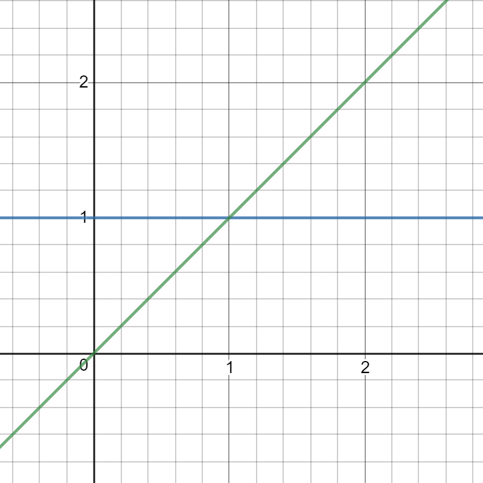

# big-O
: **알고리즘의 효율성** 을 나타내는 지표 또는 언어  

big-O를 정리하기 전에, big-O 표기할 때 자주 사용하는 *log*를 짚고 넘어가자.
## log(로그)
2^3=8 이 식은 거듭제곱이며, log_{2}8=3의 역계산임.  
log_{2}8은 *2를 몇 제곱하면 8이 되는가* 를 뜻함.  
> Tip_ 어떤 문제에서 원소의 개수가 절반씩 줄어든다면 그 문제의 수행 시간은 `O(logN)` 이 될 가능성이 큼

## 수행시간 표현 방법
퀵 정렬(Quick Sort)을 예시로 들어보자. 퀵 정렬을 구현하는 파트에서 추후 더 자세히 다룰 것.
* 최선의 경우 : `O(N)`  
배열이 정렬되어있다면 평균적으로 단순히 배열을 한 차례 순회하고 끝날 것
* 최악의 경우 : `O(N^2)`  
배열이 역순 정렬되어있고 pivot을 가장 첫번째 원소로 잡는다면, 원소 하나씩만 줄은 부분 배열로 나누게 됨  
* 평균적 경우 : `O(NlogN)`  
부분 배열을 나누는 횟수가 N번임.  
퀵 정렬은 부분 배열의 원소가 하나가 될 때까지 나누는 것을 반복함. N을 두 번째 나눌 때에는 N/2의 결과를 가지고 또 나눔. 나눌 때마다 부분 배열이 절반으로 줄어드는데, 이 때의 시간복잡도는 `O(logN)`임.  
N만큼 부분 배열을 나누는데, 나눌 때마다 원소가 절반씩 감소하므로, `O(N*logN)`임.
> Tip_어떤 경우를 제시해야 하나
> * 최선의 경우는 어떤 알고리즘이던 특수한 배열을 구성하면 O(1) 시간에 동작가능하기 때문에, 무의미해 수행시간 표현 때 배제함  
> * 많은 알고리즘은 최악의 경우와 평균적 경우가 같음. 그러나 다른 경우에, 모두 언급할 필요가 있음.

## ~~공간복잡도~~
이 topic은 스킵하겠음. 요즘은 메모리가 부족한 경우가 거의 없기 때문에, 고려하지 않겠음.

## 표시 생략
* 상수항  
    
  위 그래프를 보면 `O(N)`이 `O(1)`보다 빠른 경우가 있는 것을 알 수 있음.  
  > 이런 이유로 수행 시간에서 상수항을 무시해버린다. - 책 '코딩 인터뷰 완전 분석'에서  
      
    ~~위의 말이 이해가 가지 않아 추가적으로 찾아봄~~  
    * 추가설명  
    big-O는 실제 알고리즘의 수행 시간을 측정하기 위해 만든 것이 아니라 **장기적으로 데이터가 증가함에 따른 처리 시간의 증가율을 예측**하기 위해서 만들어짐.
상수는 고정된 숫자로, 증가율에 고정된 그 상수만큼만 영향을 미치기 때문에, 증가하지 않는 숫자는 신경쓰지 않는다는 의미.
* 지배적이지 않은 항  
`O(N^2+N^2)`은 `O(2N^2)`이지만 상수항은 생략하므로 `O(N^2)`임. 그러므로 그보다 작은 `O(N^2+N)`의 N은 생략해도 됨.

## 더하기 또는 곱하기
* 덧셈
    ```
    for (int i=0; i<N; i++)
        cout << i << endl;
    for (int i=0; i<N; i++)
        cout << i << endl;
    ``` 
    ```
    for (int i=0; i<N; i++)
        cout << i << endl;
    for (int i=0; i<M; i++)
        cout << i << endl;
    ```
    첫 번째 반복문은 ~~O(2N)~~ `O(N)`임. 그러나 두 번째 반복문은 N만큼 2번 반복하는 것이 아니라 N만큼 반복 후 M만큼 반복하는 것이므로 `O(N+M)`임
* 곱셈
    ```
    for (int i=0; i<N; i++)
        for (int i=0; i<M; i++)
            cout << i << endl;
    ```
    위 반복문은 M만큼 반복한 것을 N만큼 반복하는 것이기 때문에 `O(NM)`임.

## log N 수행 시간
이진 탐색(binary search)를 예시로 들어보자.
> 이진 탐색은 정렬된 배열에서 특정 원소를 찾을 때 사용하는 탐색 방법  
찾으려는 특정 원소와 배열의 중간값을 비교하여, 중간값보다 작으면 왼쪽을 탐색하고, 크면 오른쪽을 탐색함.  
그러다가 탐색된 원소가 하나면 중단함.

배열 원소의 개수가 16개이고 원소가 1개 남을 때까지의 수행 횟수가 k일 때, 2^k=16임.  
위 [log(로그)](https://github.com/xtal-study/coding-interview/tree/master/jeongyeon/Feb_2nd_week#log%EB%A1%9C%EA%B7%B8)에 따르면 2^k=16은 k=log_{2}16의 역계산으로 k=log_2N임.  
big-O에서 로그의 밑은 고려하지 않으므로, k=logN임. ~~고려 안하는 이유 추가 예정~~  
이처럼 수행 횟수가 증가할 때마다 원소 개수가 절반으로 줄어든다면 `O(logN)`이 될 가능성이 큼.
