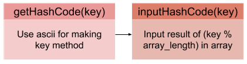

## Hash Table  
해시 테이블은 매우 빠른 탐색을 위한 알고리즘으로, `O(1)`의 빠르기를 자랑함.   
그러나, key(data)들이 특정 index에 몰리게 되면 index 안에서도 골라내야 함.  
이를 collision(충돌)이라고 하고, `O(N)`의 시간이 소요되기도 함.  
즉, **key를 hashcode로 변환하는 방법이 중요함.**  
~블록체인이 사용하는 방법이라곸~

### Collision (충돌)
data들은 무한하고, key값은 유한하기 때문에 발생함.  
* key가 다르지만, hashcode가 같은 경우
* hashcode가 다르지만, 매칭된 arr의 index가 같은 경우 (=key들이 특정 index에 몰리는 경우)

### 구현 알고리즘 예시
  
1. key를 hashcode로 변환
	* ascii 값으로 hashcode 값으로 전환하는 등의 방법 사용
2. key를 넣어줄 배열 arr을 만듦
3. (hashcode % arr의 길이 값)과 매칭되는 arr의 index에 key를 넣어줌  

### 코드
`// Link`

## Linked List
### Runner 기법
### 코드
`// Link`
